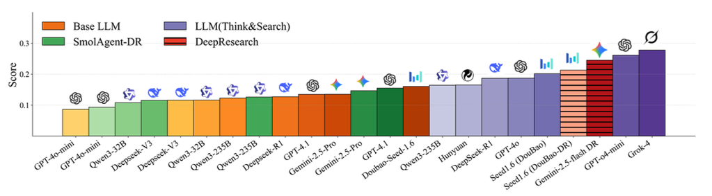

<!-- # Introducing FutureX——An Advanced Live Benchmark for LLM Agents in Future Prediction -->

In the past few years, Large Language Models (LLMs) have made astonishing progress. They are no longer mere text generators but are gradually evolving into autonomous "agents" capable of planning, using tools, and interacting with the real world. However, a sharp question lies before us: How can we truly evaluate the core intelligence of these agents?
Existing benchmarks, such as GAIA and Browsercamp, while valuable, are mostly static. This means their questions and answers are fixed and can easily be included in a model's vast training data, leading to distorted evaluation results. More importantly, they are asking AI to solve the problem that is known. Therefore, we introduce FutureX, a `live benchmark designed for predicting unknown future`.

  

Predicting the future requires an agent, much like a human expert, to gather information, analyze trends, and make decisions in a dynamic environment full of uncertainty. This is precisely the ultimate capability we hope AI will possess. However, establishing a fair, uncontaminated evaluation standard for this purpose is fraught with methodological and technical challenges.

## VISION

We firmly believe that FutureX has the potential to become a key driving force in the development of LLM agents. By providing a fair, dynamic, and highly challenging evaluation platform, we hope to inspire researchers in academia and industry to jointly develop the next generation of AI agents that can match, or even surpass, the level of professional human analysts in complex, high-stakes, real-world domains.
Our work has just begun. We welcome you to read our technical report for more details and to explore the future of AI with us.

## What is FutureX?

FutureX is a dynamic, real-time benchmark for `Future Prediction`, built on these core features:

- **No Data Contamination:** By requiring predictions of future events, it ensures answers cannot exist in any model's training data. There are around **500 new events per week**.
- **Real-World Challenge:** Agents analyze live, real-world information to make predictions for future events, not operate in a simulation.
- **Large Scale:** Utilizes **195 high-quality sources** (selected from over **2,000 websites**) covering **multiple domains**.
- **Fully Automated Pipeline:** A closed-loop system automatically collects questions, runs **27 agents** daily, and scores the results.

  

## Four Difficulty Tiers of FutureX

To evaluate agent capabilities with greater granularity, we have meticulously designed the prediction tasks into four ascending levels of difficulty:

<<<<<<< HEAD

=======

>>>>>>> f2037648fb9fbee511d56101f5f3633fc0811f5b
  

| **Level** |    **Tier**     |          **Event Type**           |                                                                      **Focus**                                                                       | **Planning** | **Reasoning** | **Searching** |
| :-------: | :-------------: | :-------------------------------: | :--------------------------------------------------------------------------------------------------------------------------------------------------: | :----------: | :-----------: | :-----------: |
|     1     |    **Basic**    |            Few choices            |                                                 Choose from fewer than 4 options from a given list.                                                  |     Weak     |     Weak      |     Weak      |
|     2     | **Wide Search** |           Many Choices            |                                              Exhaustive discrimination and Return all correct futures.                                               |     Weak     |    Medium     |    Medium     |
|     3     | **Deep Search** | Open-ended   (low volatility)  |                  Interactive search & synthesis  Navigate sources (click, scroll, filter)  Integrate evidence for an answer.                   |    Medium    |    Medium     |    Strong     |
|     4     | **Super Agent** | Open-ended   (high volatility) | Forecast high-volatility, open-ended events  Conduct wide-scope information search Reason  Predict under deep uncertainty **Super-agent** tier |    Strong    |    Strong     |    Strong     |

  

## How do we build FutureX?

To meet the challenge of real-time updates, we built a completely closed-loop, automated evaluation system. The system automatically collects new questions daily, runs 27 models to make predictions, and automatically retrieves and scores the results after the event concludes. This level of technical complexity far exceeds that of traditional static evaluation frameworks.

  

## Findings: How do current AI agents perform in future prediction?

### 1. **Grok-4 leads for now, followed by Gemini Deep Research and GPT-o4-mini.**

Across the four model types, `Grok-4` achieves the highest overall performance, followed by `Gemini-2.5-flash Deep Research`, `GPT-o4-mini (Think&Search)`, and `Seed1.6 (DouBao)`.

   

### 2. **Difficulty tiers are valid**.

The performance of all models consistently declines as task difficulty increases from Level 1 to Level 4. Models score particularly low on Level 4 tasks (open-ended, high-volatility), which strongly validates that the benchmark's difficulty stratification is accurate and can effectively measure a range of capabilities from basic recall to complex reasoning.

### 3. **Base LLMs perform well on simple tasks**.

On Level 1 (single-choice) tasks, base LLMs without tool usage perform exceptionally well. Notably, DouBao-Seed1.6-Thinking even outperforms some agents equipped with search tools. This suggests that Level 1 tasks primarily test a model's internal knowledge and have limited ability to differentiate the capabilities of more advanced models.

### 4. **Tool use is crucial for harder tasks**.

As tasks become more complex (especially Levels 2 and 3), agents that can use external tools like web search significantly outperform models that rely solely on static internal knowledge. This highlights the critical role of real-time information access and tool-augmented reasoning for solving complex, dynamic problems.

### 5. **Top models show diverging capabilities.**

- In knowledge retrieval tasks (Levels 1 & 2), `DouBao-Seed1.6-Thinking` is the top performer among base LLMs.
- In the most challenging open-ended tasks (Levels 3 & 4), `Grok-4`, `Gemini Deep Research`, and `GPT-o4-mini` stand out. They achieve an excellent balance of accuracy and efficiency (fewer searches, faster inference), even surpassing more expensive deep research models.

### 6. **AI agents still lag behind humans**.

Currently, the overall predictive capabilities of LLM agents remain behind those of human experts.

   

