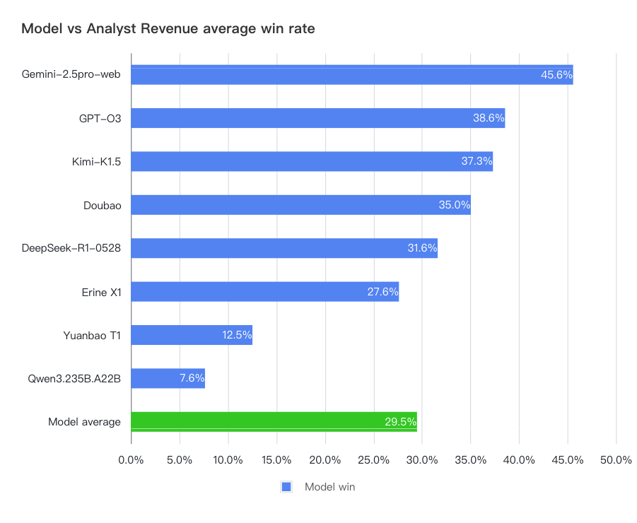
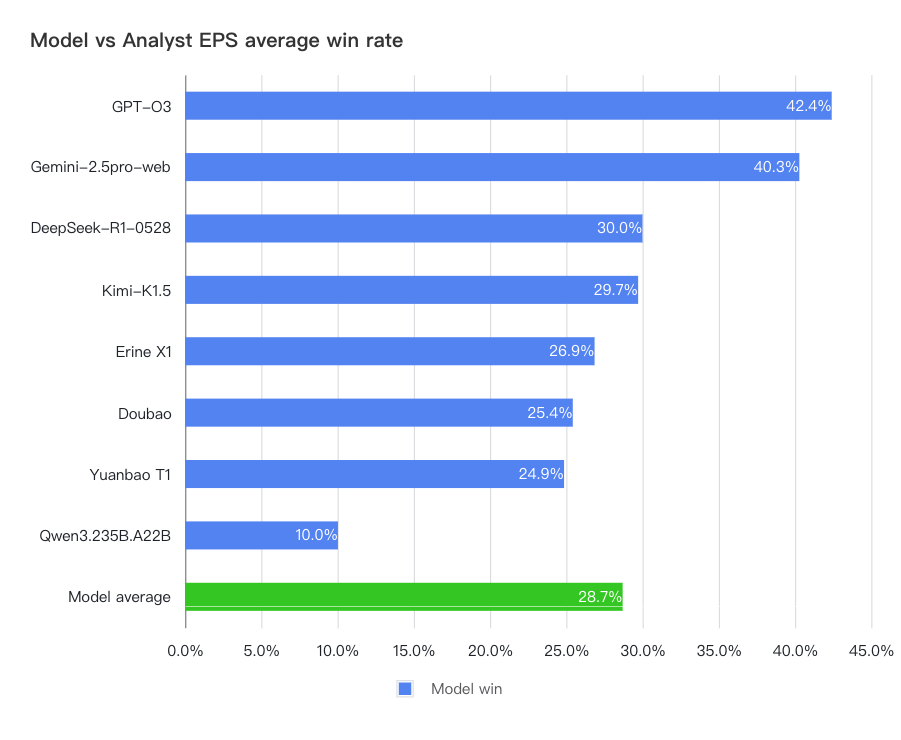
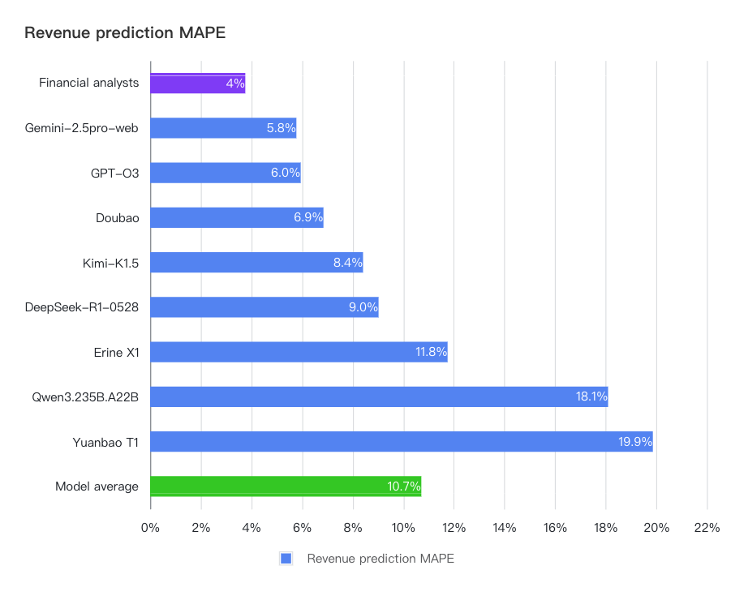
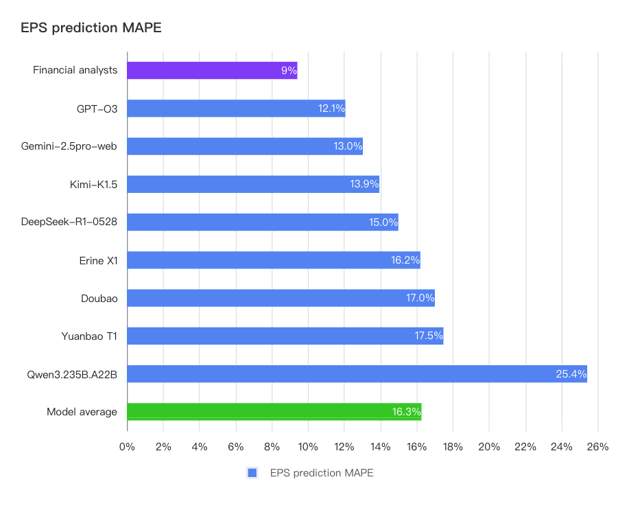
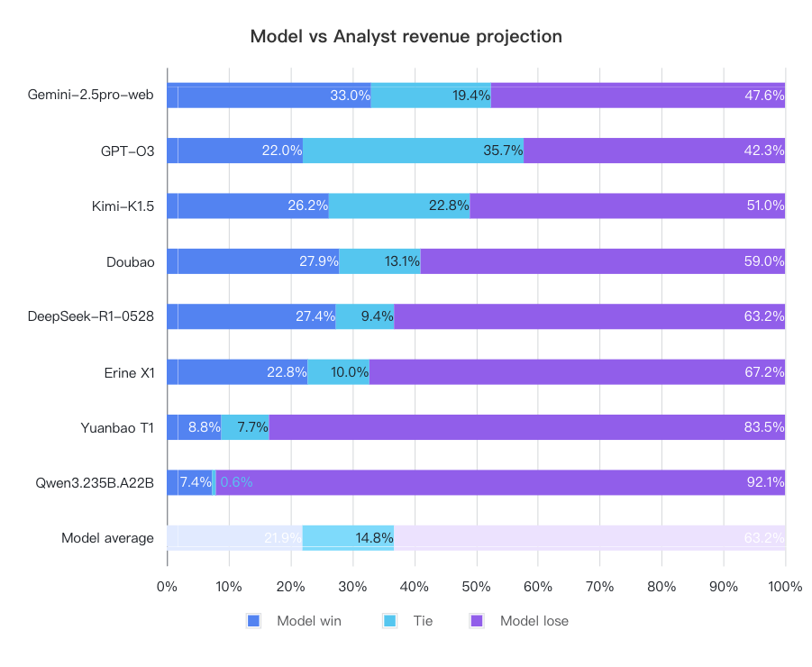
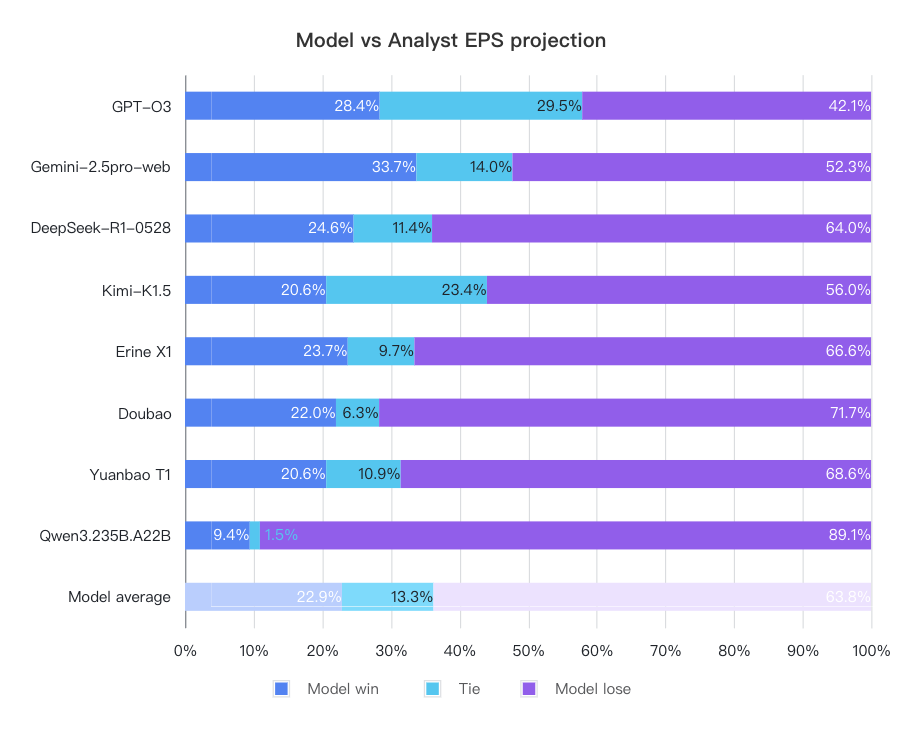

# `FutureX-S&P500` LLM vs. Wall Street Analysts on the S&P500 Prediction

> 2025.08.15

`FutureX-S&P500` focuses on the financial data prediction of S&P 500 Index Constituent Stocks.
By comparing the model's prediction results with the Consensus Estimate of human professional analysts and the finally announced actual financial report data, we hope to investigate: **To what extent can LLMs match or even surpass human financial experts in financial data prediction?**

## Why S&P 500 Financial Forecasting?

- High Frequency and Replicability: Financial reports are released quarterly, providing a natural "racetrack" for continuously tracking model iterations.
- Prevention of Existing Data Contamination: Historical events are easily searchable or have been inevitably trained into the models, making it impossible to ensure a fair evaluation.
- Natural Human Expert Control Group: Wall Street analysts have years of accumulated experience in this field, providing a quantifiable baseline. The consensus estimate can be understood as the average level of human experts.
- Practical Business Value: If the forecasts can significantly outperform analysts, it could lead to significant Alpha.

## Objectives

S&P 500 Forecast Evaluation（LLM vs. Sell-Side Analysts）

- Core Evaluation Question: Can Large Language Models (LLMs) outperform the consensus estimates of Wall Street analysts (from yhoofinance) in predicting the financial reports of Listed Companies?
- Current Task: Conduct point forecasts for the S&P 500 Index Constituent Stock (as per the list on June 30, 2025) for the next quarter's "Earnings per share" and "Revenue" (currently the second quarter of 2025)
- Core Indicators:
  1. Win Rate – Whether the error of the LLM's forecast versus the actual value is smaller than that of the analyst consensus estimate.
  2. Mean Absolute Percentage Error (MAPE) – |Forecast - Actual| / |Actual|, with a cap of 30% for errors greater than 30% to eliminate extreme values. This metric observes the average deviation of each forecast from the actual result.

## Evaluation Timeline

We followed the timeline:

| Phase   | Time                   | Actions                   | Details                                                    |
| ------- | ---------------------- | ------------------------- | ---------------------------------------------------------- |
| T+0     | 20250630               | Lock in Sample            | Obtain consensus estimate for SP500 constituent stocks     |
| T+0~3d  | 20250630-20250702      | Batch Fetch LLM Responses | Obtain model's projections with same prompt                |
| T+3~45d | Earnings Season        | Dynamic Evaluation        | Fetch financials announcement and update ranking bi-weekly |
| T+60d   | End of Earnings Season | Summary and Analysis      | Overall ranking and conclusions                            |

## Main Results

### 1. Win Rate Comparison

In terms of the final win rate of the models, the overseas SOTA models generally outperformed the domestic models —— Gemini and O3 performed exceptionally well, with average win rates for the two types of forecasts reaching 46% and 39%. The first-tier domestic models are Kimi/ DeepSeek/Doubao and Erine, with win rates around 35-27%. However, no model has yet surpassed a 50% win rate, indicating that there is still a certain gap with the level of professional analysts (usually, a net income higher/lower than the consensus will affect the company's stock price at the time of release. If the model's net income forecast win rate against analysts exceeds 50%, it means that the model's short-term financial forecasting ability has surpassed that of Wall Street analysts, and its results can generate investment value).

### 2. Error Comparison

In terms of the error compared to the actual announced results, analysts performed more stably, with the smallest average error magnitude in both revenue and profit.

_Note: If the MAPE of each model and analyst on Net Profit & Revenue is greater than 30%, it will be capped at 30% to prevent a single data point from having a significant impact._

### 3. Consider Tier Cases

By looking at the difference between the model's forecast and the consensus, we can see that although our input prompt explicitly stated that the model should arrive at its own conclusion through its own analysis, a portion of the results (for example, about 35% of the O3 revenue forecasts) were still very close to the analyst consensus forecast at the time. Large models have a tendency to make their final answers very close to the consensus. If we consider cases with a revenue difference of less than 0.5% and a net income difference of less than 1% as a tie, the gap between the models and analysts becomes more pronounced after re-calculating the results.
The new results are as follows:

