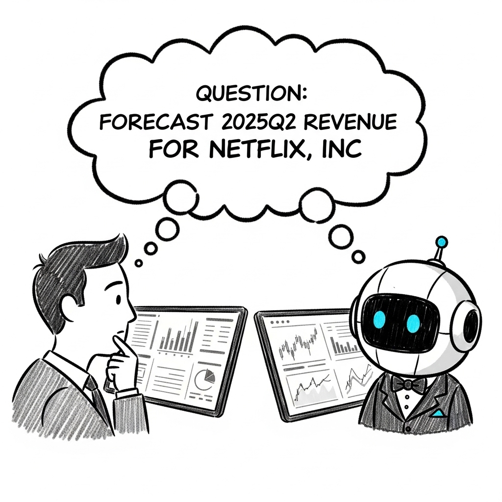
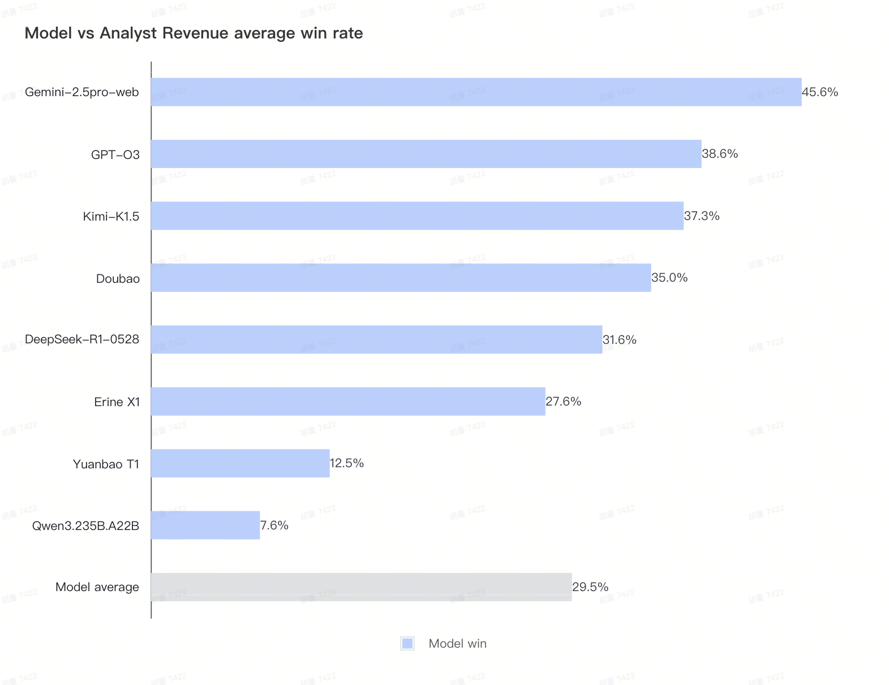
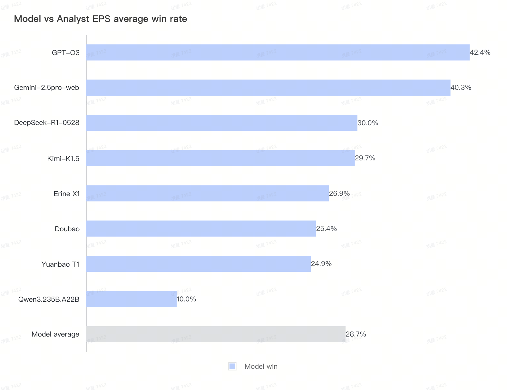
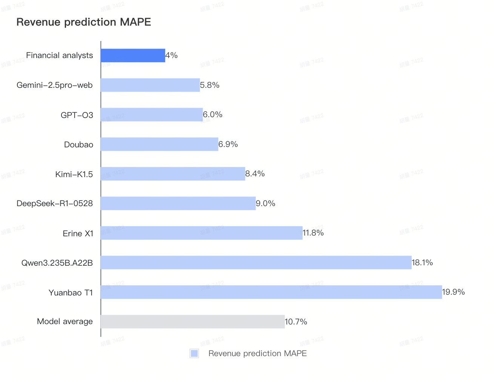
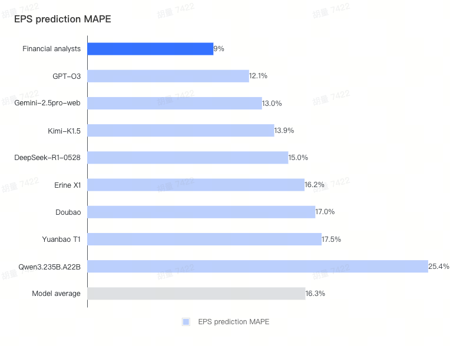
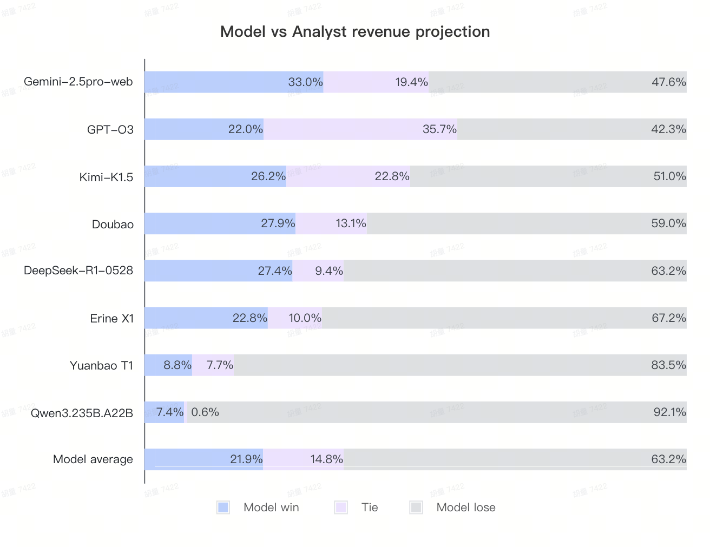
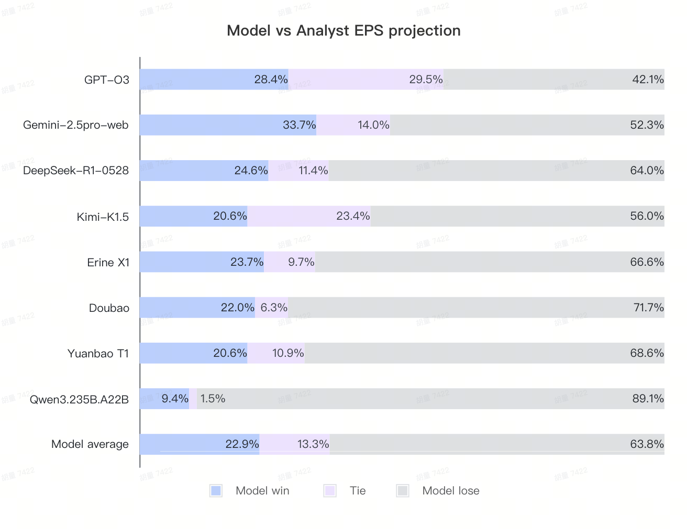

# FutureX-S&P500 

FutureX-S&P500 focuses on the **financial data prediction** of **S&P 500 Index Constituent Stocks**. 
By comparing the model's prediction results with the **Consensus Estimate** of human professional analysts and the finally announced actual financial report data, we hope to understand: **To what extent can LLMs match or even surpass human financial experts in financial data prediction?** 

<figure style="text-align: center;">
  
  <figcaption style="margin-top: 8px; font-style: italic;">Revenue prediction (figure generated by Gemini-2.5-pro).</figcaption>
</figure>

## **Why S&P 500 Financial Forecasting?**
- **Quarterly Update and Replicability**: Financial reports are released quarterly, providing a natural "racetrack" for continuously tracking model iterations.
- **Prevention of Existing Data Contamination**: Historical events are easily searchable or have been inevitably trained into the models, making it impossible to ensure a fair evaluation.
- **Natural Human Expert Control Group**: Wall Street analysts have years of accumulated experience in this field, providing a quantifiable baseline. The consensus estimate can be understood as the average level of human experts.
- **Practical Business Value**: If the forecasts can significantly outperform analysts, it could lead to significant Alpha.

## **Objectives**
**S&P 500 Forecast Evaluation**（LLM vs. Sell-Side Analysts）
- **Core Evaluation Question**: Can Large Language Models (LLMs) outperform the consensus estimates of Wall Street analysts (from yahoofinance) in predicting the financial results of Listed Companies?
- **Current Task**: Conduct point forecasts for the S&P 500 Index Constituent Stock (as per the list on June 30, 2025) for the next quarter's "**Earnings per share**" and "**Revenue**" (the second quarter of 2025)
- **Core Indicators**: 
  1. **Win Rate** – This measures whether the LLM's prediction is more accurate than the analyst consensus estimate. For each stock, we compare the absolute error of the LLM's forecast against the actual reported value with the absolute error of the analyst consensus estimate against the actual value. If the LLM's error is smaller, it counts as a "win".
     
     - Formula: Win Rate = $\frac{\text{Number of LLM wins}}{\text{Total number of predictions}} × 100\%$
     
     - Where: LLM wins when $|\text{LLM Forecast} - \text{Actual}| < |\text{Analyst Consensus} - \text{Actual}|$

  2. **Mean Absolute Percentage Error (MAPE)** – This measures the average magnitude of prediction errors as a percentage of the actual values. It provides a normalized way to compare prediction accuracy across different stocks and financial metrics, regardless of their absolute values.
     
     - Formula: MAPE = $\frac{1}{n} × \sum \frac{|\text{Forecast} - \text{Actual}|}{|\text{Actual}|} × 100\%$
     
     - Note: For each stock forecast MAPE is capped at 30% for errors greater than 30% to eliminate extreme outliers that could skew the overall assessment.

## **Evaluation Timeline**
We followed the timeline:

• **June 30, 2025 (Lock in Sample)**: Obtain consensus estimate for SP500 constituent stocks

• **June 30 - July 2, 2025 (Batch Fetch LLM Responses)**: Obtain model's projections with same prompt

• **Earnings Season (Rolling financial result release)**: Fetch financials announcement and update ranking on a rolling basis

• **End of Earnings Season (Summary and Analysis)**: Overall ranking and conclusions 

## **Main Results**

### **1. Win Rate Comparison**

In terms of the final **win rate** of the models, **Gemini** and **GPT-o3** performed exceptionally well, with average win rates for the two types of forecasts reaching **46%** and **39%**. The first-tier China models are **Kimi/ DeepSeek/Doubao** and **Erine**, with win rates around **35-27%**. However, no model has yet surpassed a **50% win rate**, indicating that there is still a certain gap with the level of professional analysts (usually, a net income higher/lower than the consensus will affect the company's stock price at the time of release. If the model's net income forecast win rate against analysts exceeds 50%, it means that the model's short-term financial forecasting ability has surpassed that of Wall Street analysts, and its results can generate investment value). The revenue / EPS win rates against analysts for each model are as follows,respectively:

### **2. Error Comparison**
In terms of the **error** compared to the actual announced results, **analysts** performed more stably, with the smallest average error magnitude in both **revenue** and **EPS**. 

*Note: If the **MAPE** of each model and analyst on **Net Profit & Revenue** is greater than 30%, it will be capped at 30% to prevent a single data point from having a significant impact.*

### **3. Consider Tie Cases**
By looking at the difference between the model's forecast and the consensus, we can see that although our input prompt explicitly stated that the model should arrive at its own conclusion through its own analysis, a portion of the results (for example, about **35% of the O3 revenue forecasts**) were still very close to the **analyst consensus forecast** at the time. Large models have a tendency to make their final answers very close to the consensus. If we consider cases with a **revenue difference of less than 0.5%** and a **net income difference of less than 1%** as a **tie**, the gap between the models and analysts becomes more pronounced after re-calculating the results.
The new results are as follows:

